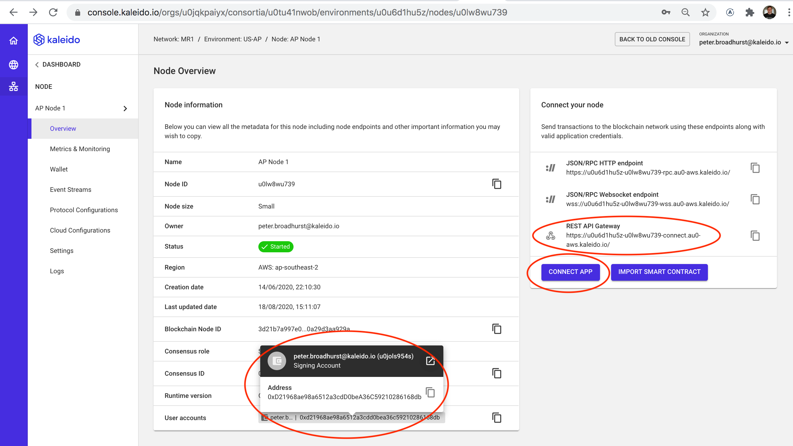
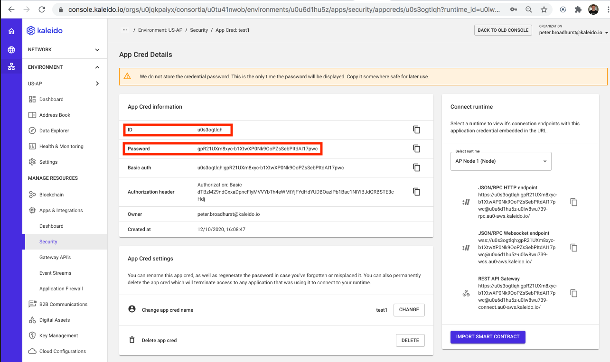

# Developer Challenge

Build a DApp on Kaleido.

Fork this repo, choose a use case you think would be interesting to build as a decentralized application (DApp), then get creative and have fun.

... and please **ask questions** - we don't want you to be stuck, an appreciate collaboration through the project.

## What is a DApp?

- [Blockgeeks](https://blockgeeks.com/guides/dapps/)
  - Background of how DApps have evolved in the wild, and why
- [State of the DApps](https://www.stateofthedapps.com/)
  - All that's been built in the wonderful world of public Ethereum
- [Kaleido docs](https://docs.kaleido.io/kaleido-platform/full-stack/dapps/)
  - DApps in an Enterprise context

## What does done look like?

We would like your project to demonstrate your concept end-to-end, but it doesn't need to be a complete application.

It must:
- Have a Web based user experience, built in React
- Have a backend-for-the-frontend (BFF), written in Node.js
- Have on-chain Smart Contract logic, written in Solidity
- Use a Kaleido blockchain 
- Contain a README that gives a quick overview of the use case, and tells us how to run it

How much time you spend on each tier is down to you - depending on your interests and the skills you want to show.

> We've given you a basic, but functional, starting point for each layer of the stack.
> ... and yes, we know the UI is a bit naff ;-)

## Some ideas

These are just ideas to give inspiration

Choose something/anything you think is interesting, and gives you license to focus on the bit of the stack you care about.

It's your choice whether you focus more on how things work under the covers, or how things feel in the UI/UX.

- A blockchain backed ratings system for Movies
- A racing simulation (you can even see one here in our [Racecourse sample](https://github.com/kaleido-io/racecourse))
- A funky avatar generator, where each avatar is backed by a unique token
- A conference ticketing system with camera & QR code integration
- A digital collectable swag bag, earned by posting to social media

## Want more dev stack?

Here are some dev technologies (not in the starter repo) that we love at Kaleido:
- Material UI (or insert your favorite component library here) - at Kaleido we love re-use
- Redux for front-end state
- GraphQL (Apollo) for front-end/back-end comms
- WebSockets (Socket.io) for live updating and notifications
- MongoDB NoSQL database for configuration and local state

Remember we'd like a thin thread through your DApp, so choose technologies you think you can be productive in.

Want to throw away most of the original `create-react-app` + `express` based repo?
No problem. Go for it.

## Setting up your Kaleido blockchain

Run through our [Quick Start](https://docs.kaleido.io/using-kaleido/quick-start-ethereum/first-blockchain/).

When you're done, you will have your very own blockchain!

## Getting this repo up and running

This repo is a thin layer on top of [create-react-app](https://github.com/facebook/create-react-app).

### Configure the config file

- Go to the Kaleido console page for your node
  - `KALEIDO_REST_GATEWAY_URL`: Grab the `REST API Gateway` URL
  - `FROM_ADDRESS`: Grab the `User account` - this will be your managed wallet signing key
  
- Click the `Connect App` button in the Kaleido console on your blockchain node
  - Then `Create new App Cred` create yourself a secure credential
- Once on the `App Cred Details` page you will need:
  - `KALEIDO_AUTH_USERNAME`: The generated `ID` (the username)
  - `KALEIDO_AUTH_PASSWORD`: The generated `Password`
  
  

Copy [backend/config.example.json](backend/config.example.json) to `backend/config.json` and edit it to the values from the Kaleido Connect panel.

### Start it up

```
# Start the backend in one terminal
cd backend
npm i
npm start

# Start a dev server for your react app in another
# Note the package.json sets `"proxy": "http://localhost:4000"` to pass through API calls to the backend
cd frontend
npm i
npm start
```

   
## Blockchain accelerators

Some full-stack blockchain services available out-of-the-box with Kaleido that you might find helpful in getting your use case built quickly:
- [Block explorer](https://docs.kaleido.io/kaleido-services/block-explorer/)
  - See the transactions that you submit from your application mined into blocks in your blockchain
- [REST API Gateway](https://docs.kaleido.io/kaleido-services/ethconnect)
  - Full details of the REST APIs you created in the quick start, and used in the sample deployment in this repo
- [IPFS](https://docs.kaleido.io/kaleido-services/ipfs)
  - Decentralized file storage, with a way to "pin" your files to your on-chain logic using hashes. Easy way to store things to big to put on the blockchain itself.
- [Token Factory](https://docs.kaleido.io/kaleido-services/token-factory)
  - Create tokens according to the ERC20/ERC721 standard via a factory UI/API, without needing to learn the code.
- [Ethereum Dev Tooling](https://docs.kaleido.io/developers/smart-contracts/)
  - Great tools to help you develop your smart contract logic

## Want to know our style?

If you want to be inspired by the Kaleido brand...


### Styles


